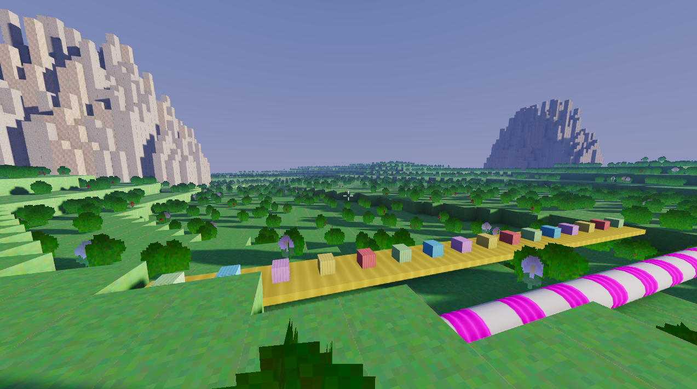

# Voxel Factory Toy

Experimental voxel-based factory toy game focused on emergent discovery, deterministic simulation, and readable systems.

## Highlights

- Grid-aligned voxel world with deterministic simulation.
- Procedural transport content: pipes, conveyors, rails, vegetation billboards.
- Slang shader pipeline (`.slang -> SPIR-V`) for Vulkan.
- Lightweight in-game debug UI for frame stats and graphics tuning.

## Vulkan + Graphics Techniques

This renderer currently uses:

- Vulkan 1.3+ baseline with dynamic rendering and synchronization2.
- Timeline semaphores for async upload/graphics sequencing.
- VMA-backed buffer/image allocation (with memory budget/priority flags).
- Optional bindless sampled-image descriptor array for texture atlas indexing.
- Reverse-Z projection and cascaded shadow mapping (atlas layout).
- SSAO path with normal/depth prepass + blur.
- Vertex AO contribution for voxel shading.
- SH-based ambient lighting from a procedural sky model.
- HDR scene path with tone mapping to LDR swapchain.
- Instanced crossed-billboard vegetation rendering.
- GPU timestamp profiling and frame timing plots in ImGui.
- Spatial clipmap-based chunk query/culling and greedy meshing support.
- Optional `VK_GOOGLE_display_timing` integration when supported by the active driver.

## Build Requirements

- CMake 3.21+
- C++20 compiler
- Ninja (recommended)
- GLFW3
- OpenGL dev package
- Vulkan loader/dev package
- Optional:
  - `slangc` in `PATH` (to recompile shaders)
  - ImGui + Vulkan Memory Allocator (via vcpkg or system packages)

## Build (Linux)

```bash
sudo apt-get update
sudo apt-get install -y \
  build-essential cmake ninja-build pkg-config \
  libglfw3-dev libvulkan-dev mesa-common-dev \
  libx11-dev libxrandr-dev libxinerama-dev libxcursor-dev libxi-dev

cmake -S . -B build -G Ninja -DCMAKE_BUILD_TYPE=Debug
cmake --build build -j
```

Run:

```bash
./build/voxel_factory_toy
```

## Build (Windows, vcpkg manifest)

Dependencies are defined in `vcpkg.json`.

```powershell
cmake --preset vcpkg
cmake --build --preset vcpkg
```

Or explicit configure:

```powershell
cmake -S . -B build-vcpkg -G Ninja `
  -DCMAKE_BUILD_TYPE=Debug `
  -DCMAKE_TOOLCHAIN_FILE="$env:VCPKG_ROOT/scripts/buildsystems/vcpkg.cmake"
cmake --build build-vcpkg -j
```

## Tests (CTest)

```bash
cmake -S . -B build -G Ninja -DCMAKE_BUILD_TYPE=Debug -DBUILD_TESTING=ON
cmake --build build -j
ctest --test-dir build --output-on-failure
```

Current test target: `voxel_foundation_tests`.

## Shader Compilation Notes

- If `slangc` is found, CMake builds `.slang.spv` targets automatically.
- If `slangc` is not found, shader compile target is skipped.
- Committed `.spv` outputs in `src/render/shaders/` allow building without local Slang.

## Controls (Current)

- `W/A/S/D` move
- Mouse look
- `Space` / `Shift` vertical movement
- `C` config panels
- `F` frame stats panel
