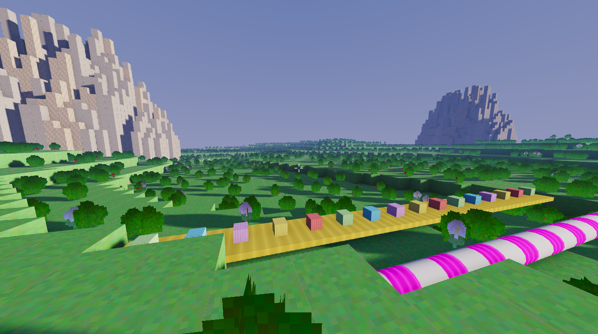

# Voxel Factory Toy

Experimental voxel-based factory toy game focused on emergent discovery, deterministic simulation, and readable systems.

## Highlights

- Grid-aligned voxel world with deterministic simulation.
- Procedural transport content: pipes, conveyors, rails, vegetation billboards.
- Slang shader pipeline (`.slang -> SPIR-V`) for Vulkan.
- Lightweight in-game debug UI for frame stats and graphics tuning.
- Voxel GI using compute surface/inject/propagate passes with occupancy/albedo volume.
- Froxel-based volumetric fog + sun shafts integration.
- Tunable color grading and post pipeline (exposure, ACES, vibrance, split tints).

## Vulkan + Graphics Techniques

This renderer currently uses:

- Vulkan 1.3+ baseline with dynamic rendering and synchronization2.
- Timeline semaphores for async upload/graphics sequencing.
- VMA-backed buffer/image allocation (with memory budget/priority flags).
- Optional bindless sampled-image descriptor array for texture atlas indexing.
- Reverse-Z projection and cascaded shadow mapping (atlas layout).
- Shadow occluder culling (toggleable) driven by camera-visible receivers + neighboring chunk casters.
- SSAO path with normal/depth prepass + blur.
- Vertex AO contribution for voxel shading.
- SH-based ambient lighting from a procedural sky model.
- HDR scene path with bloom + tone mapping to LDR swapchain.
- Post stack: auto/manual exposure, ACES fitted tonemap, white balance, contrast, saturation, vibrance, shadow/highlight tinting.
- Instanced crossed-billboard vegetation rendering.
- Volumetric height fog and sun-shaft post lighting.
- GPU timestamp profiling and frame timing plots in ImGui.
- Spatial clipmap-based chunk query/culling and greedy meshing support.
- Optional `VK_GOOGLE_display_timing` integration when supported by the active driver.

## Build Requirements

- CMake 3.21+
- C++20 compiler
- Ninja (recommended)
- GLFW3
- OpenGL dev package
- Vulkan loader/dev package
- Optional:
  - `slangc` in `PATH` (to recompile shaders)
  - ImGui + Vulkan Memory Allocator (via vcpkg or system packages)

## Build (Linux)

```bash
sudo apt-get update
sudo apt-get install -y \
  build-essential cmake ninja-build pkg-config \
  libglfw3-dev libvulkan-dev mesa-common-dev \
  libx11-dev libxrandr-dev libxinerama-dev libxcursor-dev libxi-dev

cmake -S . -B build -G Ninja -DCMAKE_BUILD_TYPE=Debug
cmake --build build -j
```

Run:

```bash
./build/voxel_factory_toy
```

## Build (Windows, vcpkg manifest)

Dependencies are defined in `vcpkg.json`.

```powershell
cmake --preset vcpkg
cmake --build --preset vcpkg
```

Or explicit configure:

```powershell
cmake -S . -B build-vcpkg -G Ninja `
  -DCMAKE_BUILD_TYPE=Debug `
  -DCMAKE_TOOLCHAIN_FILE="$env:VCPKG_ROOT/scripts/buildsystems/vcpkg.cmake"
cmake --build build-vcpkg -j
```

## Windows Runnable Release Build

The current release-oriented workflow uses the existing Windows build tree:

```powershell
cmake --build cmake-build-release --target voxel_factory_toy -j 4
```

Run `voxel_factory_toy.exe` from `cmake-build-release` so the runtime-relative asset paths resolve as expected.

Expected runtime files for a clean launch:

- `world.vxw` in `cmake-build-release` is optional; the app falls back to an empty world if it is missing.
- `assets/magicka/*.vox` must remain available relative to the project root for the Magica stamps to load.
- Required shader binaries must exist under `src/render/shaders/*.slang.spv`.
- `src/render/shaders/voxel_packed_rt.frag.slang.spv` is optional; if missing, RT beta falls back to shadow maps.

## Tests (CTest)

```bash
cmake -S . -B build -G Ninja -DCMAKE_BUILD_TYPE=Debug -DBUILD_TESTING=ON
cmake --build build -j
ctest --test-dir build --output-on-failure
```

Current test target: `voxel_foundation_tests`.

## Shader Compilation Notes

- If `slangc` is found, CMake builds `.slang.spv` targets automatically.
- If `slangc` is not found, shader compile target is skipped.
- Committed `.spv` outputs in `src/render/shaders/` allow building without local Slang.
- The release build also generates `voxel_packed_rt.frag.slang.spv` for the RT beta path when `slangc` is available.

## RT Beta Notes

- Shadow maps remain the default release path.
- The RT path is currently beta/experimental and only affects the main voxel + Magica direct sun shadow pass.
- SDF, GI, sun shafts, grass, and other shadow consumers still use the cascaded shadow-map atlas.
- If the GPU, runtime, TLAS, or RT shader variant is unavailable, the renderer falls back to shadow maps and logs the reason.

## Controls (Current)

- `W/A/S/D` move
- Mouse look
- `Space` / `Shift` vertical movement
- `C` config panels
- `F` frame stats panel

## Debug UI (Current)

- `Frame Stats`:
  - CPU/GPU timing history, per-stage GPU breakdown, draw-call counters.
- `Shadows`:
  - Tabbed layout for shadow tuning, AO/GI tuning, and display timing options.
  - Includes `Shadow Occluder Culling` toggle for on/off benchmarking.
- `Sun/Sky`:
  - Tabbed layout for sun/atmosphere, post controls, and fog/foliage.
  - Advanced controls are hidden behind collapsible sections.
